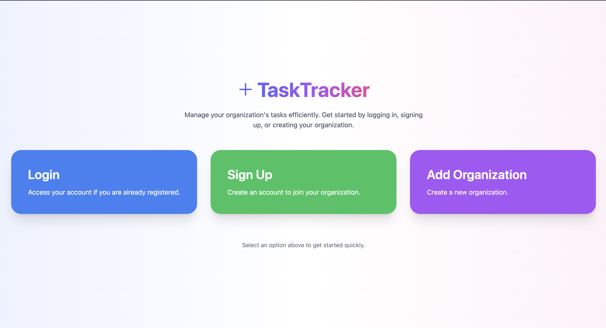
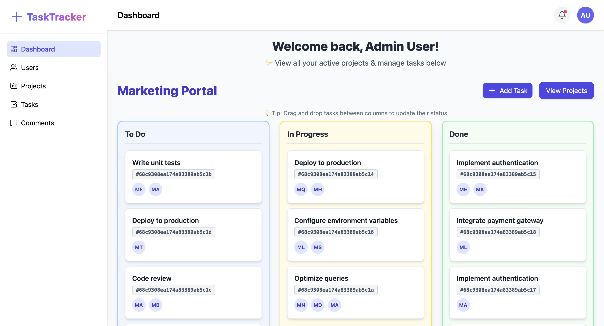
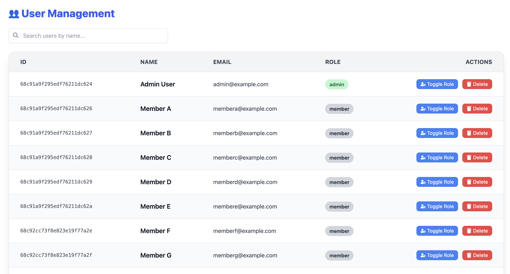
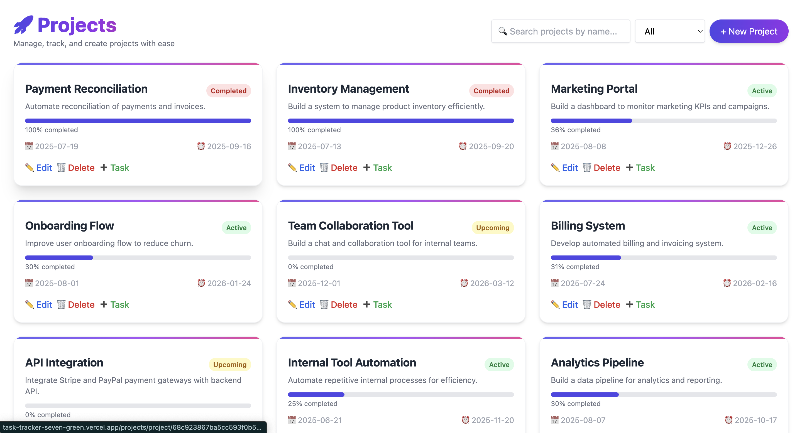
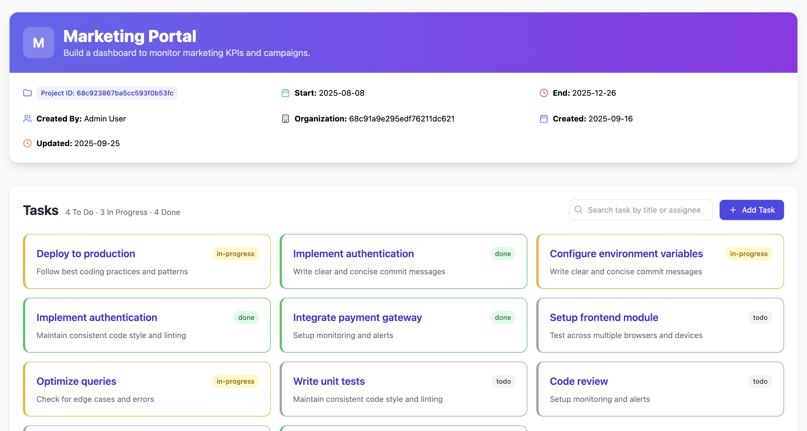
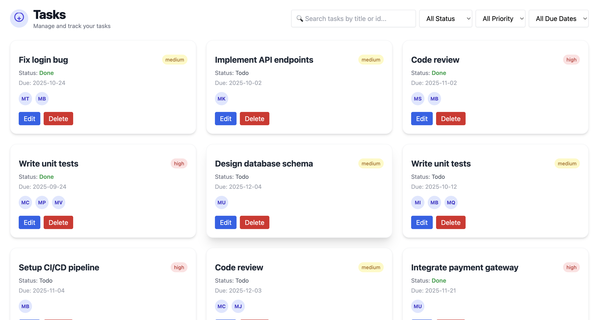
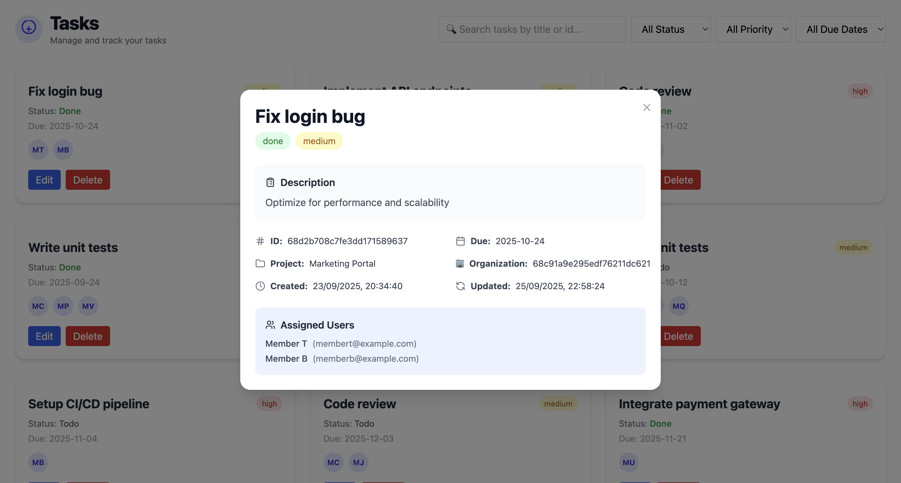
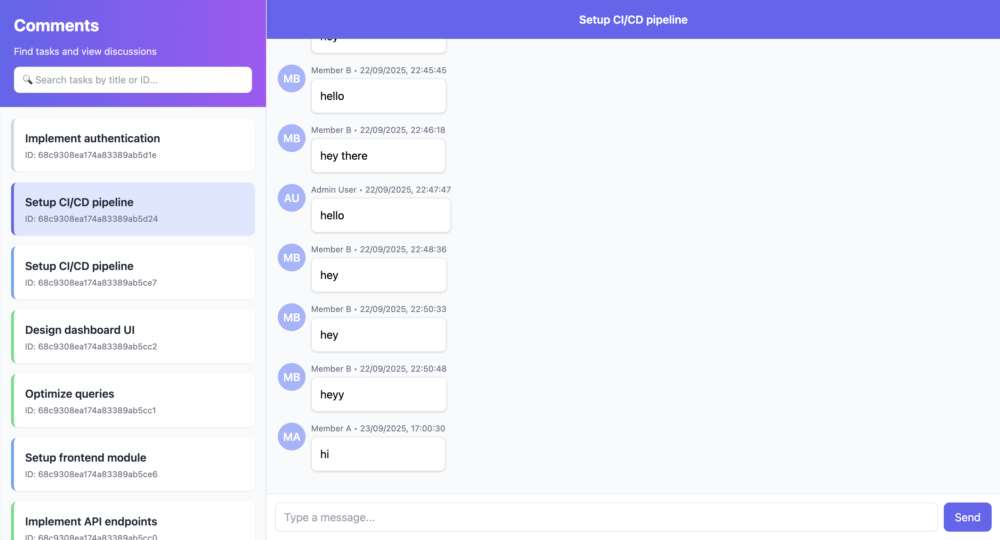

# TaskTracker 🗂️

**TaskTracker** is a modern, full-stack project management app designed for teams to collaborate, assign tasks, and track progress.

---

## 📌 Project Status: In Progress (~190 hours logged so far)

- **Backend**: Completed.  
- **Frontend**: Completed.  
- **CI/CD**: Automated pipelines configured.  

You can track my development log here: [working_hours.md](./working_hours.md)

---

## 🚀 Deployment

- **Backend API (Render):** [https://tasktracker-fr5h.onrender.com](https://tasktracker-fr5h.onrender.com)  
  - Healthcheck endpoint: [https://tasktracker-fr5h.onrender.com/ping](https://tasktracker-fr5h.onrender.com/ping) → returns `"pong"`  

- **Frontend (Vercel):** [https://task-tracker-seven-green.vercel.app/](https://task-tracker-seven-green.vercel.app/)

## 🔑 Demo Login (quick try)

Use these demo accounts to explore the app without signing up:

- **Admin (demo)**  
  Email: `admin@example.com`  
  Password: `AdminPass123!`

- **Member (demo)**  
  Email: `membera@example.com`  
  Password: `MemberPass123!`

> 🔒 Note: These are demo-only accounts (created for showcasing the app). They use `@example.com` and bypass email verification so recruiters can jump straight in. I used my personal account only for verification/testing and removed it from demo credentials.

---

## 🔧 Features

### **Frontend (React + Redux Toolkit + TypeScript)**  
- Secure login with JWT auth flow  
- Role-based UI (admins can create/update projects)  
- Authentication handled via React Context API (AuthProvider)
- Project creation & update forms with:  
  - Validation  
  - Loading states  
  - Redux-powered alert messages  
- **Real-time notifications**:  
  - Socket.IO listener integrated into Redux via thunks  
  - Bell icon indicator with unread badge  
  - Mark single/all as read  
  - Pagination for notification history  
- Task pagination (organization-wide & assigned tasks)  
- Real-time comments on tasks with auto-scroll and highlight  

### 🗂️ **Kanban Board Features**
- **Drag & Drop Tasks**  
  - Move tasks between **To Do**, **In Progress**, and **Done** columns effortlessly.  
  - Optimistic UI updates for instant feedback; fully synced with backend.  

- **Real-Time Updates**  
  - Tasks moved by any user are instantly reflected across all team members’ dashboards via **Socket.IO**.  
  - Assignee avatars (initials) and task status update in real-time without page refresh.  

- **Task Details**  
  - Quick view of **task title**, **ID**, and **assigned users**.    

- **Add & Manage Tasks**  
  - Admins can add tasks via a **shortcut button** in the dashboard.  
  - Tasks can be assigned to multiple team members with instant notification.  

- **Visual Enhancements**  
  - Column-specific color schemes for better differentiation.  
  - Smooth animations for drag-and-drop interactions using **Framer Motion**.  
  - Hover effects and responsive layout for optimal UX across devices.  

- **Optimistic + Reliable State Management**  
  - Tasks update locally instantly for fluid interaction.  
  - Backend updates ensure the database remains consistent.  
  - Rollback mechanism if API fails to prevent desync.  

### **Backend (Node.js + Express + MongoDB + Mongoose)**  
- Auth system with JWT + role-based middleware  
- Organization-based isolation of data  
- Project APIs with start/end date validation, past-date prevention  
- Task APIs with query-based filtering (`?projectId=...`) and pagination  
- **Notification system (real-time)**:  
  - Triggered on task updates (status, title, priority, due date, assignee changes)  
  - Personalized messages (*“You were removed from task X”*, *“Priority changed to High”*, etc.)  
  - Stored in MongoDB for persistence  
- Database seeding for users, projects, tasks with realistic demo data  
- Email verification (signup) + password reset (via secure token links)  
- Zod validation schemas for all critical endpoints  
- Centralized error middleware with consistent JSON responses  

---

## 🛠️ Tech Stack

- **Frontend:** React + TypeScript, Redux Toolkit (slices, thunks, reducers)  
- **Backend:** Node.js, Express, MongoDB, Mongoose  
- **Real-Time:** Socket.IO (comments + notifications + kanban drag & drop status updates)  
- **Validation:** Zod  
- **Auth:** JWT with role-based middleware  
- **Email Service:** Nodemailer + Brevo (for verification & password reset)  
- **CI/CD:** GitHub Actions → Render (backend), Vercel (frontend)  
- **Dev Tools:** ESLint, TypeScript, Nodemon  

---

## 📚 Challenges & Learnings
- Balancing API flexibility with consistent contracts.  
- Ensuring organization-based isolation early for scalability.  
- Implementing **pagination** for tasks: learned how to efficiently fetch and display data page by page, and integrate it smoothly with frontend state.  
- Adding **database seeding scripts**: improved understanding of generating realistic demo data for users, projects, and tasks, which sped up testing and development.  
- Using Zod schemas to enforce strict validation and reduce runtime errors.  
- Designing CI/CD pipelines to simulate real-world team workflows.  
- Debugging and fixing cold start issues on Vercel by introducing uptime strategies.  
- Render’s free tier blocked SMTP emails midway — solved by switching Brevo integration to HTTPS, ensuring notifications still worked without extra cost.  

## 📸 Screenshots

### Landing Page  

### Dashboard  

### Users Management  

### Projects Page  

### Single Project View  

### Tasks List  

### Task Details  

### Real-Time Comments  

